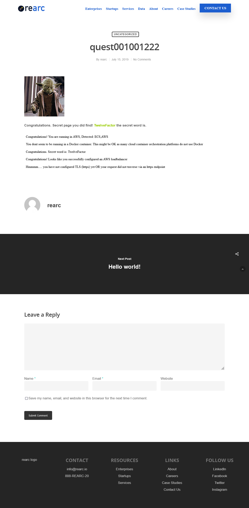

# Testing and Linting
I have `tfsec` and `tflint` installed locally. Please see `.tflint.hcl` and the various `tfsec:ignore` comments. This code passes all checks:
```
$ tfsec

No problems detected!

0 potential problems detected:

$ tflint
```
Please note that `tflint` simply exits if no issues are detected.

JS/ES/TS testing is performed via `eslint`. More instructions on this below 

# What I added:
### get-latest-terraform.sh
Script to pull down the latest Terraform version if you don't use `tfenv`.

## .eslintrc.yml
ES (ECMAscript aka JS) linting module. Run via `npx eslint src/000.js --fix` if you want to modify in place as I have done.

## .tflint.hcl
tflint requires this config file in order to resolve issues with the latest providers/plugins.

## .gitignore
Prevents committing things that are not appropriate.

## test_us-west-2.auto.tfvars
Test variable values without having to explicitly write `terraform plan/apply --var-file=`, etc.

## Dockerfile
Dockerizes the application contained in `./src/` and `./bin/`; nothing fancy here except that I used `node:current-alpine` in order to make a smaller image and not use an ancient version of Node.js.

## package.json and package-lock.json
Updated `package.json` to include eslint, reflect my changes, etc.

## All of the *.tf files
### providers.tf
Configuration for the AWS Region, profile, etc. to use for authentication and deploying resources. Note that I am using the latest AWS provider format that just came out about a week ago, and have included a work-around for https://github.com/hashicorp/terraform-provider-aws/issues/23110 which is an issue opened a few days ago and still actively being addressed.
### main.tf
This is a monolith on purpose. Good code starts as a monolith. One should break out parts of the monolith only when needed.
### variables.tf
Allows various input variables. I show off an example of a validation condition, comments, conditionals, etc.
### versions.tf
Required versions of TF and various providers. I'm using AWS provider 4.1.0, which caused some thrash as I had to rewrite a lot of stuff for the 4.x upgrade, but it was a good exercise. See https://registry.terraform.io/providers/hashicorp/aws/latest/docs/guides/version-4-upgrade for more details.
### cf_waf_acm.tf
This is just a separate .tf file to separate the module call to `cf_waf_acm` from the "main" .tf code.

## cf_waf_acm
This Terraform module takes a domain name and an origin, wires up a CF distribution + ACM cert + WAF, peforms DNS verification of the ACM cert, attaches the ACM cert to the CF distro, sets up an encrypted S3 logging Buckt for CF, etc. so that you get anti-DDoS protection + a global pull-through cache with HTTPS + a fancy domain with its own HTTPS cert, etc. I wrote this years ago, and just updated it for TF AWS provider 4.x.

## waf_rate_limit_2000 + wafv2
I wrote or co-authored both of these modules. They are required by the `cf_waf_acm` module.


# Checklist of requirements addressed by my solution
## Requirements
1. If you know how to use git, start a git repository (local-only is acceptable) and commit all of your work to it. ✔️
2. Deploy the app in any public cloud and navigate to the index page. Use Linux 64-bit x86/64 as your OS (Amazon Linux preferred in AWS, Similar Linux flavor preferred in GCP and Azure) ✔️
3. Deploy the app in a Docker container. Use `node` as the base image. Version `node:10` or later should work. ✔️
4. Inject an environment variable (`SECRET_WORD`) in the Docker container. The value of `SECRET_WORD` should be the secret word discovered on the index page of the application. ✔️
5. Deploy a load balancer in front of the app. ✔️
6. Use Infrastructure as Code (IaC) to "codify" your deployment. Terraform is ideal, but use whatever you know, e.g. CloudFormation, CDK, Deployment Manager, etc. ✔️
7. Add TLS (https). You may use locally-generated certs. ✔️

## Q. What do I have to submit?
1. Your work assets, as one or both of the following:
  - A link to a hosted git repository. ✔️
    - You're looking at it: https://github.com/sskalnik/quest
  - ~~A ZIP file containing your project directory. Include the `.git` sub-directory if you used git.~~
2. Proof of completion, as one or both of the following:
  - Link(s) to hosted public cloud deployment(s). ✔️
    - http://rearc-quest.com
  - One or more screenshots showing, at least, the index page of the final deployment in one or more public cloud(s) you have chosen. ✔️
    - 
3. An answer to the prompt: "Given more time, I would improve..."
  - Discuss any shortcomings/immaturities in your solution and the reasons behind them (lack of time is a perfectly fine reason!) ✔️
    - See this README, as well as comments in the code itself.
  - **This may carry as much weight as the code itself**

## Assets must include:
- IaC files, if you completed that task. ✔️
  - Project uses TF IaC.
- One or more Dockerfiles, if you completed that task. ✔️
  - Project contains a Dockerfile.
- A sensible README or other file(s) that contain instructions, notes, or other written documentation to help us review and assess your submission. ✔️
  - Project contains the README.md file you are reading now.
